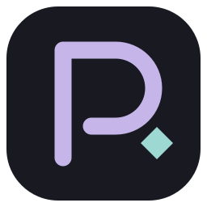

<p align="center">
  
</p>

<h1 align="center">Prestera</h1>

<p align="center">
  A place to talk, stream, and listen together.<br>
  Private rooms for up to 8 friends. No account required.
</p>

<p align="center">
  <a href="https://github.com/sabatoshinka/prestera/releases/latest">
    
  </a>
  <a href="#host-your-own-server">
    
  </a>
</p>

<p align="center">
  Windows 10 / 11 &middot; x64 &middot; Portable
</p>

---

## Make yourself at home

- **Voice and video** — noise suppression, microphone sensitivity controls, and individual volume settings.
- **Screen sharing** — up to 1080p at 60 FPS, with application audio on supported Windows systems. Adjust the bitrate up to 50 Mbps per viewer, and move and resize camera overlays while watching a stream.
- **Chat** — messages, images, GIFs, and files, with images opening right inside the app.
- **Music and soundboard** — save playlists of local tracks, play music for the room, and import and trim sound clips. Control music volume separately from voices.
- **Your own look** — avatars, profile banners, status messages, avatar frames, and custom backgrounds.
- **Controls within reach** — global hotkeys, plus chat and soundboard controls while watching a stream.

Calls use encrypted WebRTC connections, and rooms require an invitation. Share invites only with people you want to join.

## Get started

1. Open the **[latest release](https://github.com/sabatoshinka/prestera/releases/latest)** and download `Prestera-<version>-win-x64.zip` from **Assets**.
2. Extract the entire archive into a writable folder and launch **`Prestera.exe`**.
3. Choose a connection mode below, create a room, and send its invitation to your friends. They can paste it into the app to join.

The app interface is currently in Russian. The room stays open while its creator is connected.

### Choose how to connect

| Mode | When to use it |
| --- | --- |
| **Direct** | On the same local network or VPN, or when the host is reachable over the internet with the required ports forwarded. |
| **Your own server** | For friends on different networks, including behind carrier-grade NAT. Enter your server address in the app; no shared VPN is required. |

Prestera connects peers directly when possible. With your own server configured, a TURN relay carries traffic when a direct connection cannot be established. There is no bundled public server.

### Host your own server

The server runs on a Linux VPS through Docker Compose. A graphical desktop is not needed.

Download `Prestera-Server-<version>.zip` from the **[latest release](https://github.com/sabatoshinka/prestera/releases/latest)**. You'll need Docker Engine with Compose, a public IP address, and a domain pointing to your VPS. In the extracted server directory, run:

```bash
bash setup.sh
docker compose up -d --build
```

The setup script generates the configuration. The stack includes HTTPS, room signaling, and a TURN relay.

See the **[deployment guide](server/DEPLOY.md)** for firewall ports and configuration details *(guide currently in Russian)*.

## Keep your setup

Starting with **0.7.0**, settings, profiles, playlists, sounds, and local chat history live in **`%APPDATA%\Prestera\Profile`**, separate from app releases. On first launch, Prestera copies an existing `PibbleData` beside the app, or the most recently used profile from a neighboring Prestera release folder. The original stays intact. When upgrading from an older version, close it and extract the new release beside it; if you keep releases elsewhere, copy your old `PibbleData` beside the new executable before first launch.

In **Settings → Updates**, check GitHub for a new release, download it, then restart to apply it. Downloads are verified with SHA-256, and your profile stays in place. Automatic checks run at startup and can be disabled. Versions before 0.7.0 need one manual upgrade to get the updater.

Playlists reference your original audio files, so keep those files in place. Messages are delivered to connected participants; there is no offline delivery. Stream quality depends on your hardware and connection, and each additional viewer uses more upload bandwidth.

<details>
<summary><strong>Build from source</strong></summary>

On Windows, install Node.js 22+, npm, Visual Studio 2022 C++ build tools, and a recent Windows SDK.

```powershell
npm ci
npm run build:native
npm start
```

Create a portable build in `release/`:

```powershell
npm run package
```

Built with Electron, React, WebRTC, and native Windows capture helpers.

</details>
